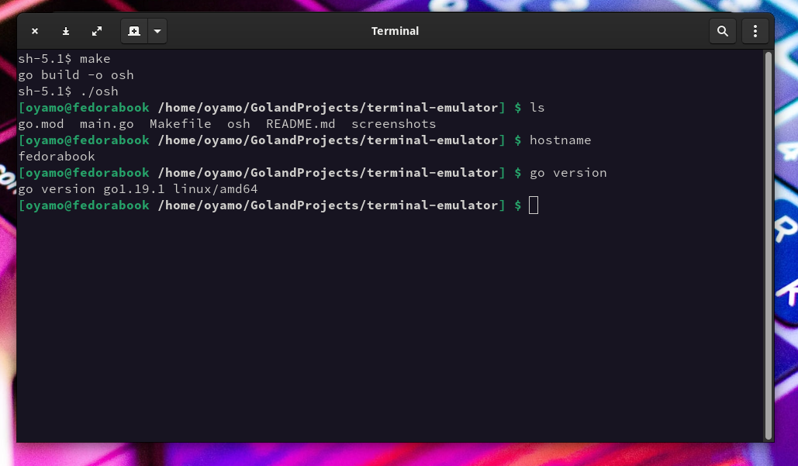

# Terminal Emulator
A system application for executing commands on the unix shell.

## Screenshot


## Building 
To build the terminal, make sure you have [Golang (Go language)](https://golang.org) language installed on your machine. When installed, run the following command 

```shell
make 
```

## Running the app
```shell
./osh
```

## Installing the app system-wide
```shell
echo "export PATH=$PATH:$PWD" >> $HOME/.bashrc
```
